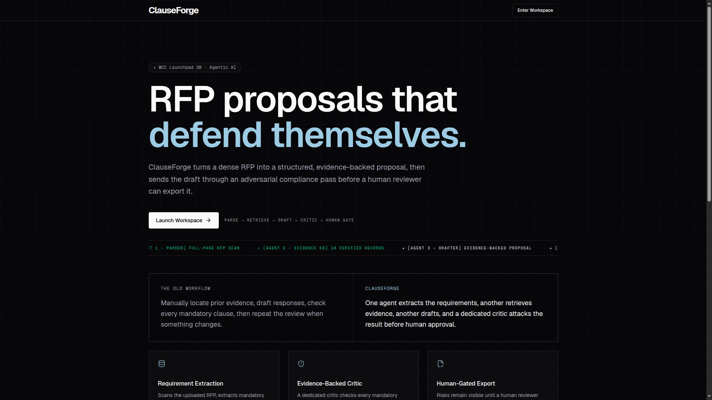
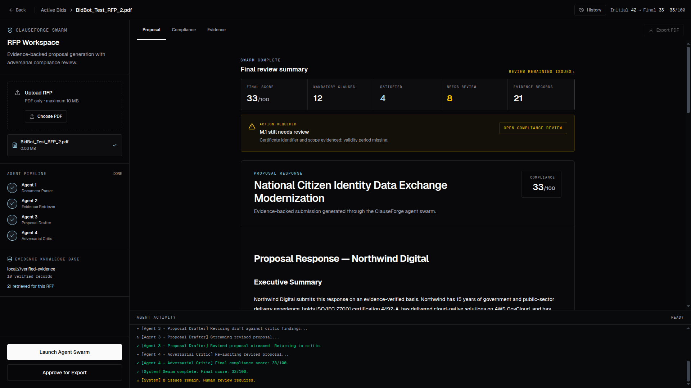
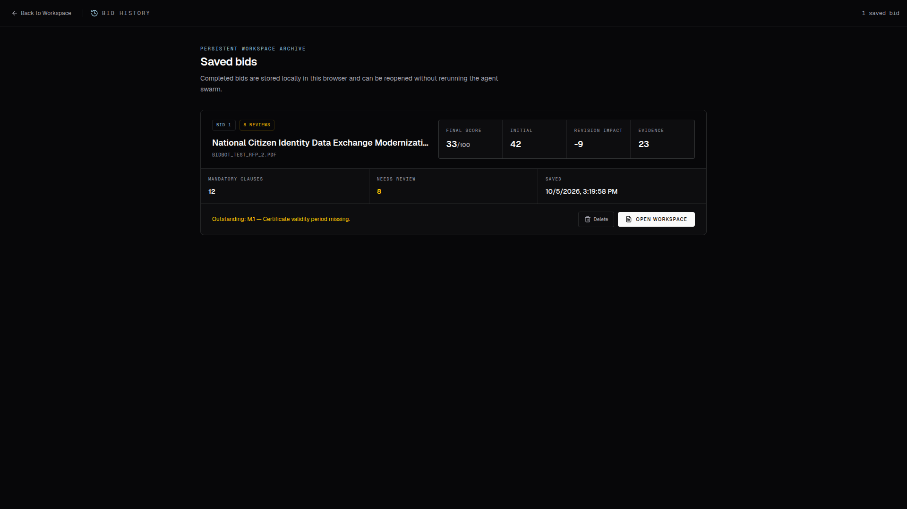

# ClauseForge

> Evidence-backed, agentic RFP proposal generation with clause-level compliance auditing and human approval.

ClauseForge is an agentic AI system that helps teams turn complex RFP documents into compliance-aware proposal drafts.

Instead of treating proposal generation as a single LLM prompt, ClauseForge separates the workflow into specialized agents:

**RFP Parser → Evidence Retriever → Proposal Drafter → Adversarial Critic → Human Approval**

The system extracts mandatory requirements from the RFP, retrieves relevant company evidence, generates an evidence-backed proposal, audits every clause, and blocks final export until a human approves the result.

---

## Screenshots

### Landing Page



### Dashboard



### History



---

## Problem

RFP responses are often created under tight deadlines and involve large amounts of manual work:

- Finding every mandatory requirement in a long document
- Matching requirements against existing company capabilities and evidence
- Writing a consistent proposal response
- Checking whether every clause was actually addressed
- Detecting unsupported or fabricated claims
- Reviewing the final response before submission

A proposal can look convincing while still missing a mandatory requirement.

ClauseForge focuses on reducing this risk through an explicit multi-agent workflow and deterministic compliance checks.

---

## Solution

ClauseForge converts an uploaded RFP into a structured compliance workflow.

### 1. Agent 1 — RFP Parser

The parser scans the uploaded PDF and extracts explicitly required and mandatory constraints.

It identifies:

- Clause IDs
- Requirement descriptions
- Mandatory status
- Project title

The parser scans the document locally and uses a bounded context window for model processing.

Protection mechanisms include:

- 10 MB maximum upload size
- 300-page maximum
- Empty/unreadable document rejection
- Structured response validation
- Clause ID normalization
- Invalid JSON handling

---

### 2. Agent 2 — Evidence Retriever

ClauseForge maintains a local evidence knowledge base containing verified company records.

The retriever matches RFP requirements against this evidence using token-overlap relevance scoring.

Each retrieved record contains:

- Requirement association
- Source ID
- Source type
- Title
- Evidence content
- Relevance score

The system does not allow the proposal writer to freely invent company credentials.

---

### 3. Agent 3 — Proposal Drafter

The proposal drafter receives:

1. Extracted RFP requirements
2. Retrieved company evidence

It is explicitly instructed to:

- Address every mandatory requirement
- Use clause IDs where appropriate
- Keep company-specific claims traceable to supplied evidence
- Never fabricate credentials, customers, certifications, dates, metrics, or outcomes
- Clearly disclose evidence gaps

The proposal is streamed to the frontend so users can see Agent 3 writing the response in real time.

Agent 3 can also perform a revision pass using Agent 4's findings.

---

### 4. Agent 4 — Adversarial Compliance Critic

The critic independently audits the generated proposal against the original RFP requirements and verified evidence.

For every supplied clause it determines whether the requirement is:

- `satisfied`
- `partial`
- `missing`

It also identifies unsupported company-specific claims.

The critic produces:

- Clause-level status
- Severity
- Issue
- Suggested correction

The final compliance score is calculated deterministically from the mandatory clause results rather than being blindly trusted from the LLM.

Any mandatory `partial` or `missing` result blocks approval.

---

## Human-in-the-Loop

ClauseForge deliberately keeps the final decision with the user.

The workflow is:

```text
RFP
 ↓
Parser
 ↓
Requirements
 ↓
Evidence Retriever
 ↓
Verified Evidence
 ↓
Proposal Drafter
 ↓
Draft
 ↓
Adversarial Critic
 ↓
Compliance Findings
 ↓
Human Approval
 ↓
PDF Export
```

A proposal cannot be exported until the human approval gate is satisfied.

This prevents the system from silently turning an unchecked model response into a submission-ready document.

---

## Architecture

```text
                    ┌─────────────────────┐
                    │      RFP PDF        │
                    └──────────┬──────────┘
                               │
                               ▼
                    ┌─────────────────────┐
                    │ Agent 1: Parser     │
                    │ Requirements        │
                    └──────────┬──────────┘
                               │
                               ▼
                    ┌─────────────────────┐
                    │ Agent 2: Retriever  │
                    │ Evidence KB         │
                    └──────────┬──────────┘
                               │
                    requirements + evidence
                               │
                               ▼
                    ┌─────────────────────┐
                    │ Agent 3: Drafter    │
                    │ Streaming proposal  │
                    └──────────┬──────────┘
                               │
                               ▼
                    ┌─────────────────────┐
                    │ Agent 4: Critic     │
                    │ Clause audit        │
                    └──────────┬──────────┘
                               │
                         findings / score
                               │
                               ▼
                    ┌─────────────────────┐
                    │    Human Approval   │
                    └──────────┬──────────┘
                               │
                               ▼
                    ┌─────────────────────┐
                    │   PDF Proposal      │
                    └─────────────────────┘
```

---

## Technology Stack

### Frontend

- React
- TypeScript
- TanStack Start
- Vite
- Tailwind CSS
- Framer Motion
- React Markdown
- jsPDF
- jspdf-autotable

### Backend

- Python
- FastAPI
- Pydantic
- pypdf
- OpenAI-compatible client
- Selora API
- `gpt-5-6-luna`

### Storage

- Local JSON evidence knowledge base
- Browser local storage for proposal history

---

## API

### Parse RFP

```http
POST /api/1-parse-rfp
```

Accepts a PDF upload and returns structured requirements.

### Retrieve Evidence

```http
POST /api/2-retrieve-context
```

Accepts extracted requirements and returns ranked evidence records.

### Draft Proposal

```http
POST /api/3-draft-proposal
```

Generates an evidence-backed proposal.

This endpoint uses Server-Sent Events (SSE) to stream proposal text to the frontend.

### Critic Review

```http
POST /api/4-critic-review
```

Audits the proposal against the supplied requirements and evidence.

---

## Reliability & Safety

ClauseForge is designed around explicit verification rather than unrestricted generation.

### Evidence Grounding

Company-specific claims must be supported by retrieved evidence.

### Requirement Coverage

Every supplied clause must receive a critic result.

Missing critic results are treated as high-severity audit failures.

### Deterministic Compliance Score

The compliance score is calculated from mandatory clause outcomes:

```text
satisfied mandatory clauses
────────────────────────────── × 100
total mandatory clauses
```

### Human Approval

Export remains locked until the proposal is explicitly approved.

### Input Limits

The backend enforces:

- Maximum file size: 10 MB
- Maximum pages: 300

### Invalid Document Handling

Documents containing no detectable mandatory RFP requirements are rejected rather than generating a meaningless proposal.

---

## Project Structure

```text
ClauseForge/
├── frontend/
│   ├── src/
│   │   ├── components/
│   │   │   └── bidbot/
│   │   │       ├── AgentTicker.tsx
│   │   │       ├── Dashboard.tsx
│   │   │       ├── HistoryPage.tsx
│   │   │       ├── Landing.tsx
│   │   │       ├── motion.ts
│   │   │       └── TransitionCoin.tsx
│   │   ├── routes/
│   │   └── assets/
│   ├── package.json
│   └── ...
│
├── knowledge_base/
│   └── evidence.json
│
├── main.py
├── requirements.txt
└── README.md
```

---

## Running Locally

### Backend

```bash
python3.12 -m venv venv
source venv/bin/activate

pip install -r requirements.txt

uvicorn main:app --reload
```

The backend runs on:

```text
http://127.0.0.1:8000
```

Set the required environment variables:

```env
SELORA_API_KEY=your_api_key
FRONTEND_ORIGIN=http://localhost:8080
```

### Frontend

```bash
cd frontend
npm install
npm run dev
```

Configure the backend URL with:

```env
VITE_API_BASE_URL=http://127.0.0.1:8000
```

---

## Production Deployment

ClauseForge can be deployed as two services.

### Frontend

Deploy the `frontend` directory to a frontend hosting provider such as Vercel.

Set:

```env
VITE_API_BASE_URL=<backend-url>
```

### Backend

Deploy the repository root to a Python hosting provider such as Render.

Start command:

```bash
uvicorn main:app --host 0.0.0.0 --port $PORT
```

Set:

```env
SELORA_API_KEY=<your-key>
FRONTEND_ORIGIN=<frontend-url>
PYTHON_VERSION=3.12.3
```

---

## Demo Flow

A typical demonstration follows this sequence:

```text
1. Upload RFP
2. Agent 1 extracts mandatory clauses
3. Agent 2 retrieves supporting evidence
4. Agent 3 streams the proposal
5. Agent 4 audits every clause
6. Compliance score is calculated
7. User reviews findings
8. User approves
9. ClauseForge exports the proposal as PDF
```

The critic can trigger a revision pass when the draft contains gaps or unsupported claims.

---

## Why ClauseForge?

Most proposal-generation systems focus on generating convincing text.

ClauseForge focuses on a different question:

**Can we prove that the generated proposal actually satisfies the RFP?**

The key design principle is:

```text
Generate → Audit → Correct → Approve
```

rather than:

```text
Prompt → Generate → Export
```

This makes compliance verification a first-class part of the proposal-generation workflow.

---

## Hackathon Context

ClauseForge was built for the **WCC Launchpad 30 Hackathon** under the Agentic AI track.

The project demonstrates how multiple specialized AI agents can cooperate while retaining deterministic validation and human oversight.

---

## License

This project is intended as a hackathon project and demonstration application.